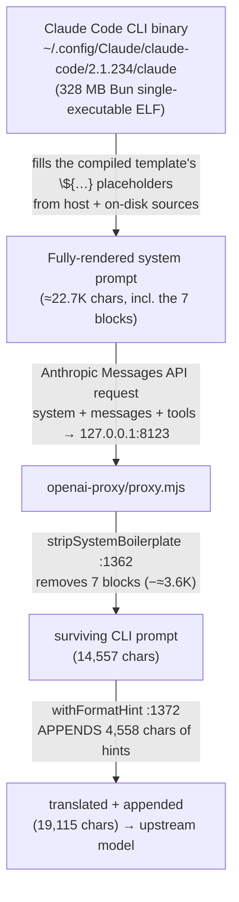

# The Code-tab system prompt: where it's stored, how it's generated

This note traces the **exact system/`instructions` string** that leaves the local proxy for the
upstream model on a Code-tab turn — where every part of it comes from, and what this repo's proxy
strips from it and adds to it.

> **The verbatim dumps are local-only and git-ignored.** This repo is public, and the dumps contain
> Anthropic's verbatim Claude Code system prompt and tool schemas, so they are kept out of git (see
> [`.gitignore`](.gitignore)). Regenerate them anytime with the steps in
> [Reproducing the dump](#reproducing-the-dump). When present, the local files are:

| File (git-ignored, generated locally) | What it is |
|---|---|
| `upstream-instructions.txt` | **The exact string the proxy sent upstream** (surviving CLI prompt **+** proxy-appended hints, after the strip), byte-for-byte. 19,115 chars. |
| `upstream-instructions.cli-portion.txt` | The head the **Claude Code CLI** authored that survived the proxy strip (chars `[0, 14557)`). |
| `upstream-instructions.proxy-appended.txt` | The tail **this repo's proxy** appended via `withFormatHint` (chars `[14557, end)`, 4,558 chars). |
| `example-full-request.txt` | The complete rendered request for context: envelope → system → user message → all 69 tool schemas. |

## Provenance of the captured example

Captured by temporarily instrumenting `callOpenAI` in `openai-proxy/proxy.mjs` to dump the outgoing
OpenAI-dialect payload for one real agent turn (the instrumentation was reverted afterward — see
[Reproducing the dump](#reproducing-the-dump)). This dump is **post-strip**: it is what actually left
the proxy, so the seven [removed blocks](#what-the-proxy-removes) are already gone.

- **Turn:** a plain user turn in a Code tab.
- **Surface:** `chat` (OpenAI `/chat/completions`). The system prompt is `messages[0].content`. On the
  **`responses`** surface the identical string is the top-level `instructions` field instead — same
  content, different envelope.
- **Model pick (env block):** `nvidia:nvidia/llama-3.3-nemotron-super-49b-v1.5` — the id the Code tab
  picked, which the CLI stamped into the environment block.
- **Actual upstream for this call:** `gemini` → `gemini-3-flash-preview`
  (`https://generativelanguage.googleapis.com/v1beta/openai/chat/completions`). The proxy routes / falls
  over **independently** of the CLI's printed model line — a live confirmation that it never rewrites
  that line.
- **Session cwd:** `/home/mk/things/llm_testing`.

## TL;DR

**The system prompt is not a file in this repo and is not generated by the proxy.** Its static
template is **compiled into the Claude Code CLI single-executable**; the CLI fills in the runtime
fields and sends it as the Anthropic `system` field. This repo's proxy then **strips** a fixed set of
operator-unwanted blocks, **translates** the result into OpenAI shape, and **appends** a
client-specific hints block before forwarding it upstream.



## Where it's stored

```
~/.config/Claude/claude-code/2.1.234/claude   ← 328 MB Bun single-executable ELF, not stripped
```

The template text is present inside that binary as **string literals** (each stored twice — once as
readable JS source, once in Bun's bytecode string table). It is **not one static blob**: the CLI
builds arrays of section strings, `.filter()`s out the null ones, formats them, and `.join("\n")`s
them at runtime. Recovered from the binary:

```js
// section assembly
return ["# Environment", "You have been invoked in the following environment: ", ...tve(u)].join("\n")
function tve(e){ return e.flatMap((t) => Array.isArray(t) ? t.map((r) => `  - ${r}`) : [` - ${t}`]) }

// the model line
`You are powered by the model named ${c}. The exact model ID is ${e}.`   // c = name(e), e = model id
```

Two environment forms coexist (an XML `<env>` form and the Markdown `# Environment` bullet form seen
here) plus at least two opener variants (main CLI vs. Agent-SDK subagent).

## How it's generated — the runtime fields

At session start the CLI fills the template's `${…}` placeholders from host and on-disk sources.
Verified on this machine:

| Section | Source |
|---|---|
| Environment (cwd, "Is a git repository") | `process.cwd()` + a `git rev-parse` probe |
| Platform / OS Version | `os.platform()` / `os.release()` |
| **`You are powered by the model …`** | the `<provider>:<model>` id the Code-tab picker sends — injected by the renderer unlock in [`app/.vite/build/mainView.js`](../../app/.vite/build/mainView.js) (`:221-295`) |
| `currentDate` | host clock |
| `# claudeMd` block (injected as a `<system-reminder>` in the **user** turn) | the per-project auto-memory index `~/.claude/projects/<cwd-with-/-as->/memory/MEMORY.md` — **not** a project `CLAUDE.md` (none exist for these projects). A cwd whose project has no `memory/` subdir gets no memory block. |
| `userEmail` | `oauthAccount.emailAddress` in `~/.claude.json` |
| Skills list / Agent types | enumerated by the CLI from its runtime registry |

> The model line reflects what the Code-tab **picked**, printed by the CLI. The proxy routes each
> request (and falls over between composite members) on its own — so the printed id and the actual
> upstream can differ, as in this capture (picked `nvidia:…`, upstream `gemini-3-flash-preview`).

## What this repo's proxy does to it

The proxy **strips, translates, and appends**. It never generates the CLI's environment/identity text
(`grep "powered by the model"` / `"invoked in the following environment"` over `proxy.mjs` → 0 hits) —
it only edits and wraps what the CLI sent.

- **Strip.** `stripSystemBoilerplate` ([`proxy.mjs:1362`](../../openai-proxy/proxy.mjs)) runs first,
  inside `withFormatHint`, so it applies on every route (agent and classifier). See
  [What the proxy removes](#what-the-proxy-removes).
- **Translate.** The Anthropic `system` field becomes the OpenAI system message
  (`messages[0]`, [`proxy.mjs:1785`](../../openai-proxy/proxy.mjs)) for the chat surface, or the
  top-level `instructions` ([`proxy.mjs:2176`](../../openai-proxy/proxy.mjs)) for the responses surface.
- **Append.** Both paths pass the (stripped) text through `withFormatHint`
  ([`proxy.mjs:1372`](../../openai-proxy/proxy.mjs)), which appends:
  - `buildFormatHint` ([`:1279`](../../openai-proxy/proxy.mjs)) — the `## Output formatting for this
    client` block: the `$…$` math rule, a **picture/SVG rule that names only the tools actually
    exposed this turn** (with none it emits a generic "no file tool" line), a background-work rule, and
    the "carry out with tools / always say something / be verbose" lines.
  - `buildPersistenceHint` ([`:1323`](../../openai-proxy/proxy.mjs)) — the `## Working autonomously`
    and `## Narrating your work` sections.
- **Gate (append only).** Appending is controlled by `policy.hints`
  ([`routes.mjs:146-164`](../../openai-proxy/routes.mjs)): **on** for `MAIN` / `COMPACTION`, **off** for
  classifier/safety routes (`PREFIX`, `SAFETY_*`). The **strip** is not gated — it runs on every route.
  Global hint kill-switches: `OPENAI_OUTPUT_FIXUPS`, `OPENAI_PERSISTENCE`.

### What the proxy removes

`stripSystemBoilerplate` deletes seven operator-unwanted blocks before forwarding, then collapses the
blank lines they leave behind. Five are **unconditional**; two are **conditional** on the matching tool
group being exposed this turn (the proxy currently forwards neither group, so both strip today, but the
guidance returns automatically if forwarding is re-enabled).

| Block | Match | Condition |
|---|---|---|
| `x-anthropic-billing-header: …` line | line regex (any `cc_version`) | always |
| Security-guidance paragraph (`IMPORTANT: Assist with authorized security testing…`) | verbatim | always |
| Pronoun-guidance paragraph (`When you use a pronoun for someone…`) | verbatim | always |
| Claude-models bullet (`- The most recent Claude models…`) | verbatim | always |
| Fast-mode bullet (`- Fast mode for Claude Code…`) | verbatim | always |
| `<simulator_tools>…</simulator_tools>` block | structural regex | only if no `mcp__Claude_Code_iOS_Simulator__*` tool exposed |
| `- Claude in Chrome (mcp__claude-in-chrome__*): …` line | structural regex | only if no `mcp__claude-in-chrome__*` tool exposed |

In this capture all seven were removed (≈3.6K chars), taking the prompt from ≈22.7K to 19,115 chars.

### The split, proven

The appended block's headers (`## Output formatting for this client`, `## Working autonomously`,
`## Narrating your work`) occur **0 times in the CLI binary** but **1–2 times in the proxy source** —
so the split is exact and lands at char **14,557** in `upstream-instructions.txt` (the marker
`## Output formatting for this client` appears exactly once there).

```
[0 .. 14557)     surviving CLI prompt  → upstream-instructions.cli-portion.txt    (14,557 chars)
[14557 .. end)   proxy-appended        → upstream-instructions.proxy-appended.txt  (4,558 chars)
```

## Reproducing the dump

The capture used a temporary edit at the top of `callOpenAI` (and the mirror at `callResponses`) in
`openai-proxy/proxy.mjs`, then reverted. To redo it:

```js
// TEMP — first line of callOpenAI (mirror in callResponses with surface:"responses" and /responses)
try {
  if (!isClassifier && payload?.tools?.length > 5)
    fs.writeFileSync(new URL("../last-request.json", import.meta.url),
      JSON.stringify({ surface: "chat", upstream: `${curProvider().baseURL}/chat/completions`,
                       provider: curProvider().id, model: payload.model, payload }, null, 2));
} catch { /* TEMP request dump */ }
```

Then restart the proxy **child** (the supervisor respawns it — kill the `proxy.mjs` child, not
`supervise.mjs`), type a turn in the Code tab, and read `last-request.json`. The upstream system
string is `payload.messages.find(m => m.role === "system").content` (chat) or `payload.instructions`
(responses). Because the dump sits in `callOpenAI`/`callResponses` — *after* `toOpenAI`/`toResponses`
run `stripSystemBoilerplate` — it already reflects the post-strip prompt. **Remove the edit and
restart afterward.**

## Caveats

- The captured string is one real turn (cwd `llm_testing`). The **CLI-authored** portion varies per
  session (cwd, git flag, model id, memory index, skills/agents) and by which of the seven blocks were
  present to strip; the **proxy-appended** portion varies with the tools exposed that turn and the
  `OPENAI_*` flags.
- "At least two" opener variants were confirmed in the binary (main CLI + Agent-SDK); a third was not
  proven. The `official CLI for Claude` substring also appears inside other sentences, so raw grep
  counts are not a clean "variants × encodings" decomposition.
